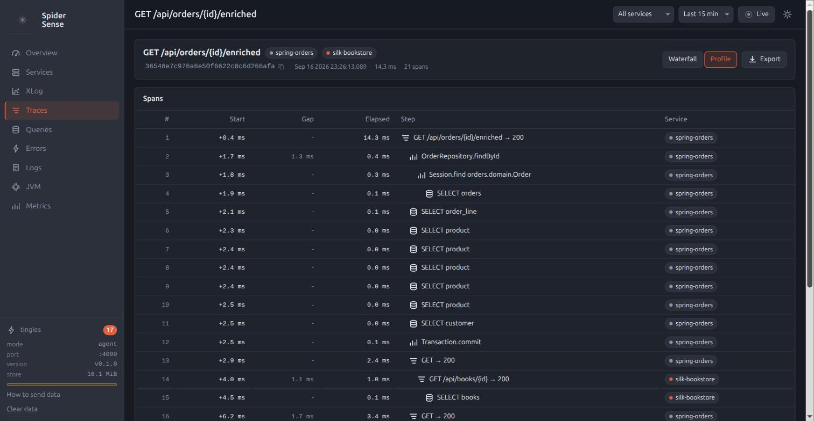
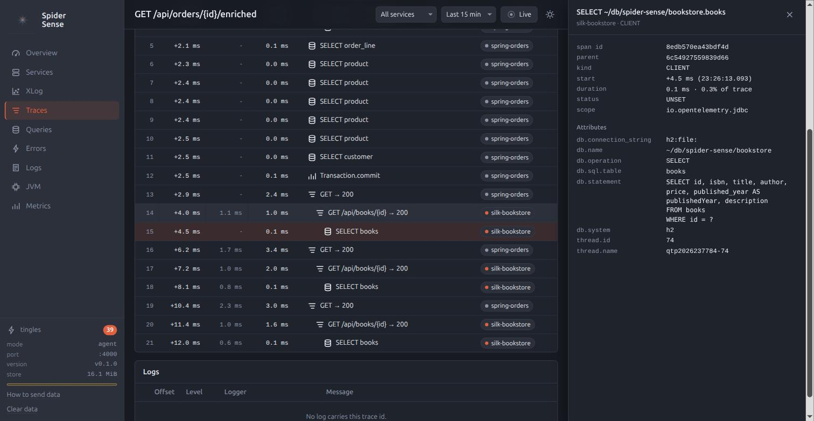
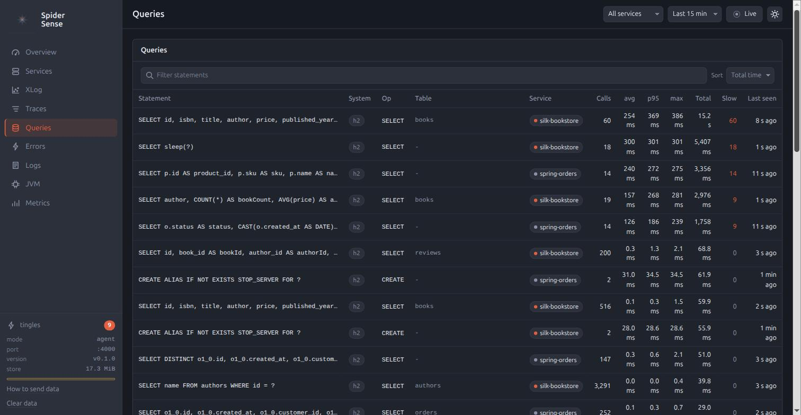
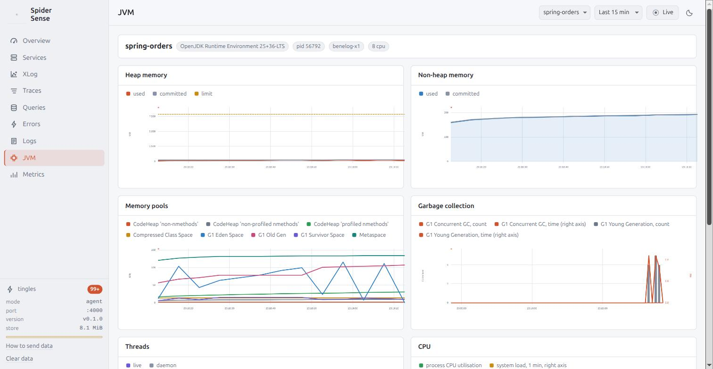
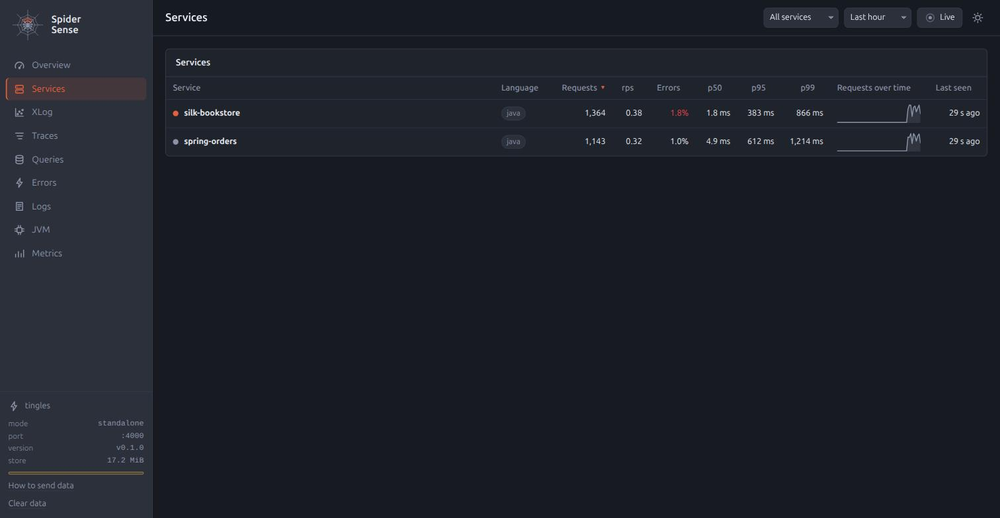

<p align="center">
  
</p>

<p align="center">
  
  
  
  
</p>

# Spider Sense

Feel what moves on the web.

Spider Sense is an APM for the local development loop.
One jar, one JVM option, and a browser tab that shows every request, every SQL statement, every error and the JVM's vital signs of the application you are working on, a second after they happen.

It is a sibling of [Spider Silk](https://github.com/benelog/spider-silk), the web framework its UI is built with, and it follows the same idea: thin by design.

- **A Glowroot-style deployment, OpenTelemetry data.**
  `-javaagent:spider-sense.jar` is all it takes, like Glowroot.
  Unlike Glowroot, the instrumentation is the stock [OpenTelemetry Java agent](https://github.com/open-telemetry/opentelemetry-java-instrumentation) and the collector speaks OTLP/HTTP, so anything that emits OpenTelemetry can send to it.
- **Nothing to install, and the data outlives the application.**
  No Docker, no account, no server to run.
  What it collects goes into an H2 file under `~/db/spider-sense/`, so after the application has stopped or crashed, `java -jar spider-sense.jar` opens the same screens on the same data; rows older than a day are swept.
- **Built for the questions you ask while coding.**
  Which endpoint is slow, which query made it slow, what did that request do step by step, what threw, what did the log say at that moment.

## Quick start

Requires Java 21 or later.

```bash
./gradlew :spider-sense-agent:senseJar
java -javaagent:spider-sense-agent/build/libs/spider-sense-0.1.0.jar -jar your-app.jar
```

Open <http://localhost:4000>.

## Three ways to run it

| Mode | Command | When |
|---|---|---|
| Agent | `java -javaagent:spider-sense.jar -jar app.jar` | One application. The UI runs inside its JVM on port 4000. |
| Agent, forwarding | `java -javaagent:spider-sense.jar -Dspidersense.collector=http://localhost:4000 -jar app.jar` | Several applications sharing one UI, or an application that must not host a web server. |
| Standalone | `java -jar spider-sense.jar` | Collector and UI only. Point any OpenTelemetry SDK at it with `OTEL_EXPORTER_OTLP_ENDPOINT=http://localhost:4000` and `OTEL_EXPORTER_OTLP_PROTOCOL=http/protobuf`. |

Every `otel.*` system property and `OTEL_*` environment variable of the OpenTelemetry agent still applies; Spider Sense only fills in defaults.
`-Dspidersense.port=4001` moves the UI; the full table is in [docs/design.md](docs/design.md#configuration).

## Spring Boot, from the build

`bootRun` and `spring-boot:run` fork the JVM themselves, so the agent has to be handed to the build tool.
With Gradle it is one plugin, which puts `-javaagent` on `bootRun` (and `bootTestRun`, and the `application` plugin's `run`) and names the service after the project:

```groovy
plugins {
    id 'org.springframework.boot' version '4.1.1'
    id 'net.benelog.spidersense' version '0.1.0'
}

spiderSense {          // optional; every property of the jar has a line here
    port = 4001
}
```

```bash
./gradlew bootRun                                          # under Spider Sense, UI at :4001
./gradlew bootRun -PspiderSense.enabled=false              # without it
./gradlew -q spiderSense --args="findings --since=start"   # the CLI, pointed at the right port
```

With Maven the Spring Boot plugin's own `agents` parameter does it:

```bash
mvn spring-boot:run -Dspring-boot.run.agents=/path/to/spider-sense.jar
```

[docs/build-tools.md](docs/build-tools.md) has the plugin's block and tasks, the POM profile that fetches the jar from Maven Central, and the test-task setup for both.

## What you see

<p align="center"></p>

| Page | What it answers |
|---|---|
| Overview | Is anything wrong right now: request rate, Apdex, error rate, p95, requests by response-time bucket, and the feed of *tingles* (slow requests, slow queries, errors) as they happen. |
| Map | A Pinpoint-style server map: services, databases and external hosts as nodes, calls as edges; click a node for its response summary. |
| Services, Endpoints | Which route costs the most: calls, rps, Apdex, p50/p95/p99, errors, status codes, and the queries and errors behind it. |
| Scatter | A Scouter- and Pinpoint-style scatter: every request as a dot on time × response time, or as a heatmap; drag over a cluster to see those traces. |
| Traces | The list, the waterfall, a span drawer with every attribute and stack trace, and a Scouter-style profile view: what the request did, step by step, with gap and self times. |
| Queries | SQL statements grouped as the agent sanitised them: calls, avg, p95, max, total time, who calls them. |
| Errors | Exceptions grouped by type and message, with a sample stack trace and the traces they occurred in. |
| Logs | The application's log records with trace ids, so a trace and its log lines are one click apart. |
| JVM, Metrics | Heap, GC, threads, CPU, classes and connection pools from the agent's metrics, and an explorer for every other metric. |

<p align="center">
  
  
</p>
<p align="center">
  
  
</p>
<p align="center">
  
  
</p>

The data is in an H2 file under `~/db/spider-sense/`, so the screens are still there after the application has stopped: `java -jar spider-sense.jar` opens the same database.

<p align="center"></p>

## For AI agents

The same jar is a command line, and the answers are made for an agent's loop: change the code, run, hit a few endpoints, read what to fix, check that the fix held.

```bash
java -jar spider-sense.jar mark before                     # name the moment
# exercise the endpoints, or run the tests
java -jar spider-sense.jar findings --since=before          # ranked: N+1, slow queries, slow endpoints, errors, exhausted pools
java -jar spider-sense.jar trace 4bf92f3577b34da6a3ce929d0e0e4736   # one request as a tree, repeats collapsed
# fix, restart
java -jar spider-sense.jar compare --before=before --after=start     # the same endpoints and queries, side by side
java -jar spider-sense.jar check --max-queries-per-request=10       # exit code 0 or 1
```

Every command prints Markdown (`--json` for the JSON), asks the running Spider Sense over HTTP, and reads the H2 file directly when none is running, so it still answers after the application has crashed.
`skills/spider-sense/` is a skill that teaches an agent the whole loop, and `java -jar spider-sense.jar init` installs it into a project's `.claude/skills/` together with a few lines in the project's `CLAUDE.md` saying where the jar is; [docs/agent.md](docs/agent.md) is the specification.

The same six answers are also an MCP server, for a host that has no shell: `POST /mcp` on the UI's port, or `java -jar spider-sense.jar mcp` over stdio, which `init --mcp` writes into the project's `.mcp.json`.
The two call the same handlers and print the same bytes, so pick by host, not by taste:

| Host | Use |
|---|---|
| An agent with a shell (Claude Code, Codex CLI, Gemini CLI, Aider, a script) | the CLI and the skill: `init`, then the commands above |
| A host without a shell (Claude Desktop, a browser-based agent, an IDE chat panel) | MCP: `init --mcp`, or `http://127.0.0.1:4000/mcp` |
| CI or a build gate | `check`, whose exit code is the verdict, or the Gradle plugin's `spiderSense` task |

Not both in one host: two tools with the same answer make the model choose and cost the schema twice.

## The examples

Two deliberately misbehaving applications and a load generator, so there is something to look at:

- [examples/silk-bookstore](examples/silk-bookstore): Spider Silk, spring-jdbc, H2 with 200,000 unindexed rows: a full-scan search, an N+1 page, a query that sleeps, a slow URL that does no SQL, an endpoint that fails at random.
- [examples/spring-orders](examples/spring-orders): Spring Boot 4, Spring Data JPA, H2: a slow revenue report, a lazy-loading N+1, an endpoint that calls the bookstore over HTTP so one trace spans two services, a state machine that throws, a flaky endpoint.
- [examples/load-gen](examples/load-gen): drives both at a few requests per second.

```bash
scripts/demo.sh             # each app with its own embedded Spider Sense (:4000 and :4001), no extra process
scripts/demo-shared.sh      # one standalone Spider Sense both apps forward to, so a cross-service trace shows in one UI
```

## How it is built

[docs/design.md](docs/design.md) explains the single jar (the OpenTelemetry agent verbatim, a dependency-free launcher, and the collector + UI as a nested jar in an isolated class loader), the in-memory store, and what was rejected and why.
[docs/api.md](docs/api.md) is the JSON contract between the server and the UI.
[docs/ui.md](docs/ui.md) is the UI specification.
[docs/build-tools.md](docs/build-tools.md) is the Gradle plugin and the Maven setup.

## License

Apache-2.0.
