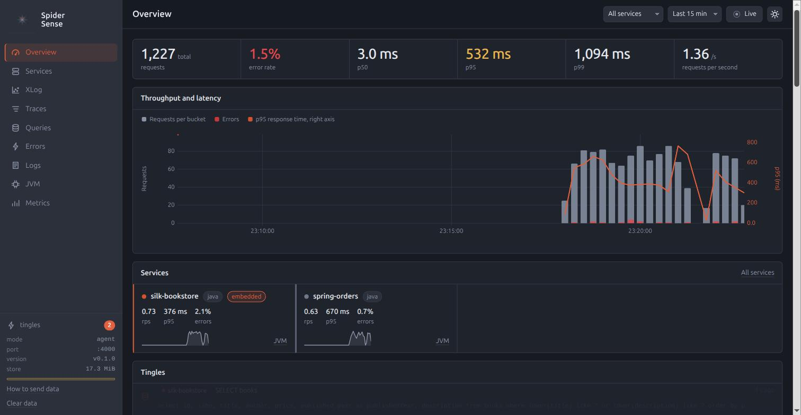
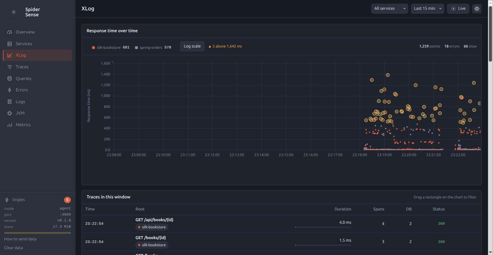
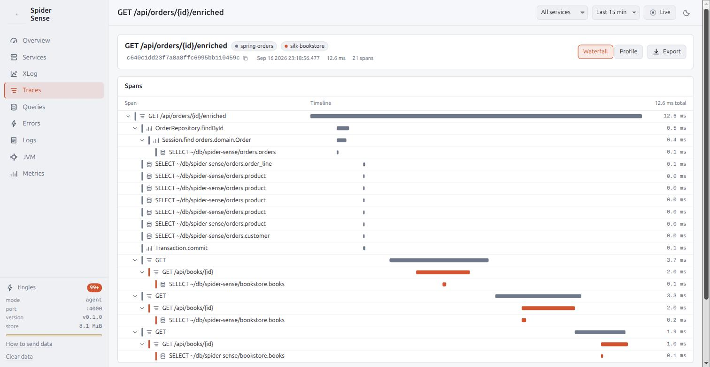

<p align="center">
  
</p>

<p align="center">
  
  
  
  
</p>

# Spider Sense

Feel what moves on the web.

Spider Sense is an observability tool for the local development loop.
One jar, one JVM option, and a browser tab that shows every request, every SQL statement, every error, every log line and the JVM's vital signs of the application you are working on, a second after they happen.
It takes the three OpenTelemetry signals, traces, metrics and logs, and answers with them what is slow, what failed and why, and what the application was doing at that moment.
The same jar is a command line whose answers are written for an AI coding agent: what is wrong, ranked, with the trace that proves it.

It is a sibling of [Spider Silk](https://github.com/benelog/spider-silk), the web framework its UI is built with, and it follows the same idea: thin by design.
The instrumentation is the stock [OpenTelemetry Java agent](https://github.com/open-telemetry/opentelemetry-java-instrumentation), the collector speaks OTLP/HTTP, nothing has to be installed, and the data goes into an H2 file under `~/db/spider-sense/` that outlives the application.

It is for three things:

- **An AI coding agent fixes what it can see.** The same jar is a command line whose answers carry numbers and trace ids, so an N+1 in a JPA repository or a query without an index is found and fixed in the agent's own loop, before `git commit` and `git push`.
- **A developer watches the application while writing it.** Every request, query, error and log line of the application on the local machine, a second after it happens, so a problem is noticed while the code is still open.
- **The tests become a diagnosis.** A test run under Spider Sense leaves the same traces, queries, errors and logs as a request from a browser, so `findings` says what the code the tests exercised did wrong, and `check` fails the build on it. The fastest feedback there is, for the agent and the person alike: one `./gradlew test`, and the N+1 is named before anyone opens a browser.
- **The OpenTelemetry setup is checked before it ships.** A custom meter, a span attribute or a Spring Boot Actuator metric is confirmed to be collected and aggregated as intended before the application reaches a development server.

It is Java-first but not Java-only: in standalone mode the jar is a collector and dashboard for any platform with an OpenTelemetry SDK, and a Java application can send from the stock OpenTelemetry Java agent, or any compatible agent, instead of the Spider Sense jar.

**The manual is at <https://spider-sense.benelog.net>.**
This page is the short version: where to see it, how to start it, and what it looks like.

## Demo

Recordings of the demo, with nothing to install and no server behind them:

- UI demo: the UI over five minutes of four deliberately misbehaving example applications under one Spider Sense
  - <https://spider-sense.benelog.net/demo>
  - <https://www.dolthub.com/repositories/benelog/spider-sense-demo>: the DoltHub database the page reads, with the same tables a running Spider Sense keeps plus the answers captured once, to query as SQL
- Agent demo: real runs of `/spider-sense` asking for the three biggest problems and the lines that cause them, replayed from the agents' event streams
  - Claude Code
    - <https://spider-sense.benelog.net/agent-demo/claude-code/> (English)
    - <https://spider-sense.benelog.net/agent-demo/claude-code/ko/> (한국어)
  - Codex CLI
    - <https://spider-sense.benelog.net/agent-demo/codex/> (English)
    - <https://spider-sense.benelog.net/agent-demo/codex/ko/> (한국어)

Every trace opens, but nothing updates.
[examples/README.md](examples/README.md) describes the example applications and runs the same demo locally, live, with the CLI beside it and an agent to hand it to.

## Quick start

Requires Java 21 or later.

```bash
./gradlew :spider-sense-agent:senseJar
java -javaagent:spider-sense-agent/build/libs/spider-sense-0.1.0.jar -jar your-app.jar
```

Open <http://localhost:4000>.

| Mode | Command | When |
|---|---|---|
| Agent | `java -javaagent:spider-sense.jar -jar app.jar` | One application; the UI runs inside its JVM on port 4000. |
| Agent, forwarding | `java -javaagent:spider-sense.jar -Dspidersense.collector=http://localhost:4000 -jar app.jar` | Several applications sharing one UI. |
| Standalone | `java -jar spider-sense.jar` | Collector and UI only. Any OpenTelemetry SDK (Node.js, Python, Go, .NET) or agent sends to it with `OTEL_EXPORTER_OTLP_ENDPOINT=http://localhost:4000` and `OTEL_EXPORTER_OTLP_PROTOCOL=http/protobuf`; with `-javaagent:opentelemetry-javaagent.jar` that is a Java application under the stock agent. |

Under Gradle the plugin puts the agent on `bootRun` and `run`, and with Maven the Spring Boot plugin's `agents` parameter does it:

```groovy
plugins {
    id 'net.benelog.spidersense' version '0.1.0'
}
```

[The Three Modes](https://spider-sense.benelog.net/modes.html), [Configuration](https://spider-sense.benelog.net/configuration.html), [The Gradle Plugin](https://spider-sense.benelog.net/gradle-plugin.html) and [Maven](https://spider-sense.benelog.net/maven.html) in the manual have the rest.

## What you see

<p align="center"></p>

<p align="center">
  
  
</p>
<p align="center">
  
  
</p>

Overview, a server map, services and endpoints, a scatter of every request, traces as a waterfall and as a profile, queries, errors, logs with trace ids, the JVM, and an explorer for every other metric, Spring Boot Actuator's included.
[The Pages](https://spider-sense.benelog.net/pages.html) describes each one.

## For AI agents

```bash
java -jar spider-sense.jar mark before                     # name the moment
# exercise the endpoints, or run the tests
java -jar spider-sense.jar findings --since=before          # ranked: N+1, slow queries, slow jobs, errors, exhausted pools
java -jar spider-sense.jar trace 4bf92f3577b34da6a3ce929d0e0e4736   # one request as a tree, repeats collapsed
# fix, restart
java -jar spider-sense.jar compare --before=before --after=start     # the same endpoints and queries, side by side
java -jar spider-sense.jar check --max-queries-per-request=10       # exit code 0 or 1
```

Every command prints Markdown, takes `--json`, asks the running Spider Sense over HTTP, and reads the H2 file directly when none is running.
The same answers are an MCP server for a host without a shell, and `check` is a build gate.
Two skills teach an agent what to do with them: `skills/spider-sense/` runs the loop, and `skills/spider-sense-sql-tuning/` turns a slow query or an N+1 into the index to add, the rewrite or the fetch join, confirmed by the plan and proven by `compare`; `java -jar spider-sense.jar init` installs both into a project.
[Quick Start for Agents](https://spider-sense.benelog.net/agent-quickstart.html) in the manual chooses between the CLI and MCP and lists what to ask; [docs/agent.md](docs/agent.md) is the specification.

## Documentation

The manual at <https://spider-sense.benelog.net> is what to read; the specifications it is written from are in the repository:
[docs/design.md](docs/design.md) (the single jar, the store, what was rejected and why), [docs/storage.md](docs/storage.md) (the H2 schema), [docs/api.md](docs/api.md) (the JSON contract), [docs/ui.md](docs/ui.md) (the pages), [docs/agent.md](docs/agent.md) (findings, marks, compare, check, the CLI, MCP and the skill) and [docs/build-tools.md](docs/build-tools.md) (the Gradle plugin and Maven).

## License

Apache-2.0.
